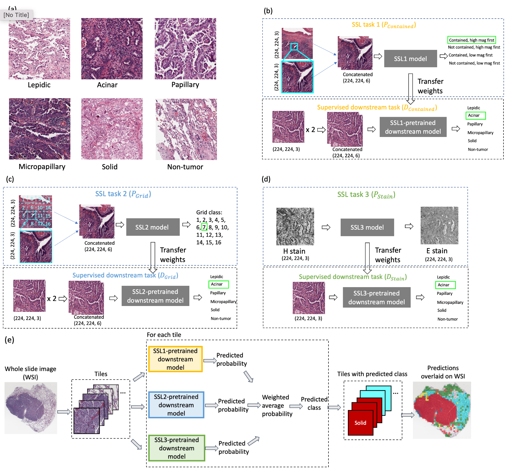

# ssl_luad_classification
Tailoring Pretext Tasks to Improve Self-Supervised Learning in Histopathologic Subtype Classification of Lung Adenocarcinomas

Lung adenocarcinoma (LUAD) is a morphologically heterogeneous disease with five different histologic subtypes. Fully supervised convolutional neural networks can improve the accuracy and reduce subjectivity of LUAD histologic subtyping using hematoxylin and eosin (H&E)-stained whole slide images (WSIs). However, the annotation process is time consuming and labor intensive. In this work, we propose three self-supervised learning (SSL) pretext tasks to reduce labeling effort. These tasks not only leverage the multi-resolution nature of the H&E WSIs but also explicitly consider the relevance to the downstream task of classifying the LUAD histologic subtypes. Two of the tasks involve predicting the spatial relationship between tiles cropped from lower and higher magnification WSIs. We hypothesize that these tasks induce the model to learn to distinguish different tissue structures presented in the images, thus benefiting the downstream classification. The third task involves predicting the eosin stain from the hematoxylin stain, inducing the model to learn cytoplasmic features which are relevant to LUAD subtypes. The effectiveness of the three proposed SSL tasks and their ensemble was demonstrated by comparison with other state-of-the-art pretraining and SSL methods using three publicly available datasets. Our work can be extended to any other cancer types where tissue architectural information is important.



## Directory structure
```
    preprocessing
    ├── generate_tiles.py    # Generate tiles from a whole slide image      
    ├── util.py # Helper functions for generating tiles          
    ├── generate_tiles_4_magnification_levels_contextual.py # Generate tiles for JigMag task where the 4 tiles of different magnifications have contextual relationship with each other.  
    ├── generate_low_high_magnification_image_pairs.py # Generate higher magnification tiles from a lower magnification tile based on the downsampling factor
    ├── stain_separation.py # Stain separation to get H-stained and E-stained images 

    modeling
    ├── proposed_ssl1                    # Implementation for proposed SSL task 1
    │   ├── dataloader.py             # Dataloader
    │   ├── model.py            # Model architecture
    │   └── main.py         # Train and validation
    ├── proposed_ssl2         # Implementation for proposed SSL task 2
    │   ├── dataloader.py             # Dataloader
    │   ├── model.py            # Model architecture
    │   └── main.py         # Train and validation
    ├── proposed_ssl3         # Implementation for proposed SSL task 3
    │   ├── dataloader.py             # Dataloader
    │   ├── model.py            # Model architecture
    │   └── main.py         # Train and validation       
    ├── baseline_ssl_byol     # Implementation for contrastive learning method BYOL
    │   ├── dataloader.py             # Dataloader
    │   ├── model.py            # Model architecture
    │   └── main.py         # Train and validation
    ├── baseline_ssl_simsiam  # Implementation for contrastive learning method SimSiam
    │   ├── dataloader.py             # Dataloader
    │   ├── model.py            # Model architecture
    │   └── main.py         # Train and validation
    ├── baseline_ssl_magnification_level_prediction # Implementation for tile magnification level prediction model
    │   ├── dataloader.py             # Dataloader
    │   ├── model.py            # Model architecture
    │   └── main.py         # Train and validation
    ├── baseline_ssl_jigmag   # Implementation for JigMag
    │   ├── dataloader.py             # Dataloader
    │   ├── model.py            # Model architecture
    │   └── main.py         # Train and validation
    ├── downstream            # Implementation for downstream individual classification model
    │   ├── dataloader.py             # Dataloader
    │   ├── model.py            # Model architecture
    │   └── main.py         # Five-fold cross validation including train, validation, and test
    ├── downstream_ensemble   # Implementation for downstream ensemble model
    │   ├── dataloader.py             # Dataloader
    │   ├── model.py            # Model architecture
    │   └── main.py         # Ensembling predictions from the individual SSL-pretrained downstream models
    │   └── model_weights
        │   └── proposed_ssl1 # Trained weights for proposed SSL1-pretrained downstream model
        │   └── proposed_ssl2 # Trained weights for proposed SSL2-pretrained downstream model
        │   └── proposed_ssl3 # Trained weights for proposed SSL3-pretrained downstream model
```
## Instructions 
### Preprocessing
Download NLST data from [NLST](https://wiki.cancerimagingarchive.net/display/NLST/NLST+Pathology), download TCGA data from [TCGA-LUAD](https://portal.gdc.cancer.gov/projects/TCGA-LUAD), and download CPTAC data from [CPTAC](https://wiki.cancerimagingarchive.net/pages/viewpage.action?pageId=33948253).

Use [generate_tiles.py](./preprocessing/generate_tiles.py) to generate tiles of specified magnification level specified by `mag_level (string)`, the parent folder path containing all patients and slides `wsi_root_path`, destination folder path `wsi_tiles_root_dir`, and cohort name `cohort_name`('nlst', 'tcga', 'cptac').  
Use [get_low_high_magnification_image_pairs.py](./preprocessing/get_low_high_magnification_image_pairs.py) to generate tiles pairs by specifying magnification level of the lower magnification tile at `mag_level (string)`, the parent folder path containing all patients and slides `wsi_root_path`, destination folder path`wsi_tiles_root_dir`, and cohort name `cohort_name`('nlst', 'tcga').  
Use [stain_separation.py](./preprocessing/stain_separation.py) to generate H-stained image tiles and E-stained image tiles. Change the parent folder path containing all tiles that need to be stain separated using `input_root_path` and the parent folder path for storing stain separated tiles using`dest_root_path`.

Each dataset's folder structure should be:
```
  ├── <patient_id>                   
  │   ├── <slide_id>   
```
### Modeling
For any model, run `main.py` after changing the train (`train_images`), validation (`valid_images`), and/or test image (`test_images`) paths accordingly.  

For proposed SSL 1 and 2, the input folder structure should be:

```
  ├── train                   
  │   ├── <path_to_a_low_high_magnification_image_pair>
      │   ├── <path_to_low_magnification_image.png>
      │   ├── <path_to_high_magnification_image.png>
  ├── validation                  
  │   ├── <path_to_a_low_high_magnification_image_pair>
      │   ├── <path_to_low_magnification_image.png>
      │   ├── <path_to_high_magnification_image.png>
```
For proposed SSL 3, the input folder structure should be:
```
  ├── train                   
  │   ├── <path_to_h_stain_images>
      │   ├── <path_to_image1.png>
      │   ├── <path_to_image2.png>
      │   ├── ...
  │   ├── <path_to_e_stain_images>
      │   ├── <path_to_image1.png>
      │   ├── <path_to_image2.png>
      │   ├── ...
  ├── validation       
  │   ├── <path_to_h_stain_images>
      │   ├── <path_to_image1.png>
      │   ├── <path_to_image2.png>
      │   ├── ...            
  │   ├── <path_to_e_stain_images>
      │   ├── <path_to_image1.png>
      │   ├── <path_to_image2.png>
      │   ├── ...
```
For downstream model, the input folder structure should be:
```
  ├── train                   
  │   ├── <path_to_a_folder_containing_one_tissue_class>
      │   ├── <path_to_image1.png>
      │   ├── <path_to_image2.png>
      │   ├── ...
      ├── ...
  ├── validation       
  │   ├── <path_to_a_folder_containing_one_tissue_class>
      │   ├── <path_to_image1.png>
      │   ├── <path_to_image2.png>
      │   ├── ...    
      ├── ...        
  ├── test      
  │   ├── <path_to_a_folder_containing_one_tissue_class>
      │   ├── <path_to_image1.png>
      │   ├── <path_to_image2.png>
      │   ├── ... 
      ├── ...         
```


